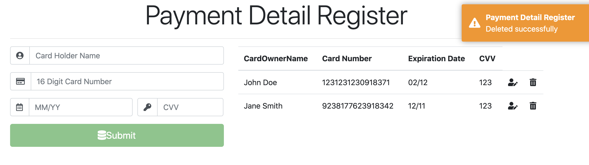

# PaymentDetailRegistry
is a simple payment management system built using Angular which calls ASP.NET Core Rest APIs. 
This front end web application is developed in ASP.NET core for the server side, angular 7 on the client side,
and reads data from MySQL database to build a basic CRUD app to track payment details.
This project is not production ready and still a work in progress. Motivation for this project is purely for personal learning/educational purposes.

**Screenshots:**

*Verification:*

*Add new payment detail:*

*Edit/Update fields* (autopopulates):

*Delete payment detail:*

*DB payment detail:*

